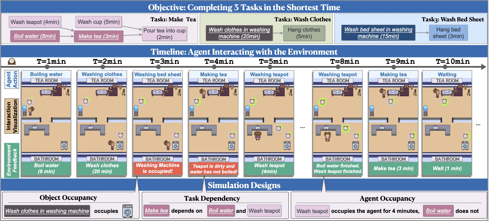

<p align="center">
     <br>
</p>
<h1 align="center">TIMEARENA: Shaping Efficient Multitasking Language Agents in a Time-Aware Simulation </h1>


<p align="center">
[<a href="https://time-arena.github.io/">Website</a>]
[<a href="https://arxiv.org/abs/2402.05733">Paper</a>] 

</p>


# TimeArena

TimeArena is a dynamic and interactive environment that integrates time to enable human-like efficient multitasking, which challenges agents to handle multiple tasks and parallel processing to save time.

It grounds to 30 real-world tasks in cooking, household activities, and laboratory work.

<p align="center">
     <br>
</p>

More details are in the paper.

## Setup Environment

Create a conda environment and install dependency:
```bash
conda create -n timearena python=3.11
conda activate timearena
pip install -r requirements.txt
```

## Running


### Evaluating LLMs
#### For Closed Source Models
If you want to evaluate GPT or Gemini, please enter the corresponding API_KEY.

```bash
# if you want to use openai's model
export OPENAI_API_KEY=YOUR_OPENAI_KEY
# if you want to use google's model
export GOOGLE_API_KEY=YOUR_GOOGLE_KEY
```

Running ``test.sh`` lets agents to interact with TimeArena and saves the interaction trajectory.
```bash
# household1 refers to the first task of the household activity scenario).
list=("household1"
"household2"
"household3"
"household4"
"household5"
"household6"
"household7"
"household8"
"household9"
"household10")
for item in "${list[@]}"
do
    python LLM_test.py --taskName $item --lm gpt3.5 --total_time 40 --save_path ./trajectory/single --save_name $item
done
```

Required arguments：

1. `--taskName` refers to the tasks you want to evaluate. If you want to combine tasks, please separate the two task names with a comma. Eg, "cooking1,cooking2"
2. `--lm` refers to the language models you want to evaluate
3. `--total_time` refers to the maximum time for completing a task. For one task, 40 is enough. If there are n task combinations, it is recommended to set it to n*40 (consistent with the setting in the paper)
4. `--save_path` refers to the folder where the generated output will be stored
5. `--save_name` refers to the file name of the generated output

Optional arguments
1. `--constraint` refers to apply resource constraints. (In cooking scenario, we limit the number of pot, fryer and oven to at most one).
2. `--sp` refers to self-plan prompting method.


#### For Open Source Models
For open source models, deploy the model as an API using <a href="https://docs.vllm.ai/en/latest/">vLLM</a>

For example:
```bash
python -m vllm.entrypoints.openai.api_server --model facebook/opt-125m --port 8001
```

Then, running ``test.sh`` lets agents to interact with TimeArena and saves the interaction trajectory.
```bash
# household1 refers to the first task of the household activity scenario).
list=("household1"
"household2"
"household3"
"household4"
"household5"
"household6"
"household7"
"household8"
"household9"
"household10")
for item in "${list[@]}"
do
    python LLM_test.py --taskName $item --lm mistral --total_time 40 --save_path ./trajectory/single --save_name $item --model_name ../hf_model/Mistral-7B-Instruct-v0.2 --ip http://localhost --port 8090
done
```

Required arguments：

1. `--taskName` refers to the tasks you want to evaluate. If you want to combine tasks, please separate the two task names with a comma. Eg, "cooking1,cooking2"
2. `--lm` refers to the language models you want to evaluate
3. `--total_time` refers to the maximum time for completing a task. For one task, 40 is enough. If there are n task combinations, it is recommended to set it to n*40 (consistent with the setting in the paper)
4. `--save_path` refers to the folder where the generated output will be stored
5. `--save_name` refers to the file name of the generated output
6. `--model_name` refers to model name for deploying vLLM
7. `--ip` refers to the ip address of the model
8. `--port` refers to the port of the model


Optional arguments
1. `--constraint` refers to apply resource constraints. (In cooking scenario, we limit the number of pot, fryer and oven to at most one)
2. `--sp` refers to self-plan prompting method.


### Calculate Four Metrics
Code for calculate the four metrics in the paper: Average Progress Score (score, AS), Completion Speed (score per minute, CS), Task Completion Rate (%, CR) and Average Completion Time (minutes, CT).

To calculate the metrics:
```bash
cd metrics
bash bash_cal_metric.sh
```

For example:
```bash
# The folder path to calculate the metrics
MY_PATH="../trajectory"

python cal_metric.py --path $MY_PATH
```


### Calculate Oracle Performance

To calculate the oracle performance of tasks, you can execute the following code and input the list of tasks in `bash_cal_oracle.sh`


```bash
cd algorithm
bash bash_cal_oracle.sh
```

For example:
```bash
# List contains a total of ten combined tasks. For example, the first combined task is cooking1 and cooking2 (the first and second tasks of the cooking scenario).
list=('cooking1,cooking2'
'cooking2,cooking3'  
'cooking3,cooking4' 
'cooking4,cooking5' 
'cooking5,cooking6' 
'cooking6,cooking7' 
'cooking7,cooking8' 
'cooking8,cooking9' 
'cooking9,cooking10'
'cooking10,cooking1')

python cal_oracle.py --task "${list[@]}"
```


## Contact

If you have any problems, please contact [Yikai Zhang](mailto:ykzhang22@m.fudan.edu.cn).

## Citation

If our paper or related resources prove valuable to your research, we kindly ask for citation. 


```
@article{zhang2024timearena,
  title={TimeArena: Shaping Efficient Multitasking Language Agents in a Time-Aware Simulation},
  author={Zhang, Yikai and Yuan, Siyu and Hu, Caiyu and Richardson, Kyle and Xiao, Yanghua and Chen, Jiangjie},
  journal={arXiv preprint arXiv:2402.05733},
  year={2024}
}
```

